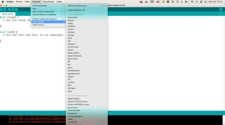
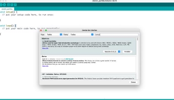

**Laboratorio 1:** Sensores y Actuadores **Asignatura:** Robótica y Sistemas Autónomas **Materiales** 

- Arduino Uno 
- Sensor Ultrasónico 
- Sensor Foto-resistencia 
- Resistencia entre 330 ohmios y 10 Kohmios 
- Protoboard de 170 puntos 
- Cable USB 
- Cables Dupont Macho-Hembra y Macho-Macho 
- ServoMotor SG90 

**Procedimiento** 

`      `Se desea conectar dos sensores un sensor ultrasonido y un sensor piezoeléctrico. Se requiere realizar un programa en Arduino Uno que pueda hacer uso del actuador con las siguientes restricciones:

- Si la distancia es mayor e igual a 80 cms y hay mucha luz el servo debe girar 180 grados. 
- Si la distancia es menor e igual a 30 cms  y hay poca luz  el servo debe girar 60 grados. 
- Si la distancia es 2 cms y no hay luz el servo debe quedarse quieto.

Deberá usar los puertos digitales 10, 11 y 12 para  conectar el sensor SR04 y el servo SG90. Deberá configurar para que el servo inicie en su posición inicial que es 0 grados.

Para  conectar  el  sensor  de  foto-resistencia  deberá  usar  el  siguiente  esquema  de conexión:  

La resistencia R1 no necesariamente debe ser de 10KOhmios. 

1-  Hacer el esquema de conexión en TinkerCard. (**15 ptos**) 

2-  Responder las siguientes preguntas: (**10 pto**) 

a-  Información del datasheet del sensor SR04 y de la fotoresistencia (LDR).  

Deberá consultar las propiedades del sensor algunas son: costo, velocidad de operación, tasa de error, robustez, peso, tamaño, etc.

b-  Información del datasheet de Arduino UNO y consultar el tipo de 

microcontrolador, memoria, y número de puertos análogos y digitales. 

c-  ¿Para qué sirve la resistencia en fija unida con la fotoresistencia? 

d-  ¿Cuál es la diferencia entre pull-down y pull-up? 

3-  Hacer el programa realizando el IDE de Arduino (Código). Debe instalar la 

librería Servo para poner a funcionar el actuador. (**10 ptos**) 

4-  Una vez se encuentre funcionando su circuito con Arduino UNO. Responder 

las siguientes preguntas: (**10 ptos**) 

a-  ¿Qué pasa si se cambia el ancho del pulso en que se activa y desactiva el 

Trigger? 

b-  ¿Cuáles es el rango de valores que se reciben del puerto A0? 

c-  ¿Qué pasa si la resistencia R1 cambia de valor, ¿cómo afecta el valor? 

¿Qué valores de resistencia han usado?

5-  Funcionamiento del circuito. Mostrar el funcionamiento al profesor para 

validar este punto. (**20 ptos**) 

6-  Enviar el link del repositorio donde se encuentre el desarrollo del laboratorio 

(diagrama, código y respuesta de preguntas). Colocar en el repositorio un readme.md con el nombre de los integrantes **(5ptos)** 

**Ayuda** 

**¿Cómo importar una librería en Arduino UNO?**  Ir a la opción de menú Programa---Incluir Librería 

Seleccionar la opción Administrar biblioteca, dar clic y se abrirá el gestor de librerías  

Escribir la palabra servo: 

Seleccionar la opción que aparece en recuadro rojo y dar clic en instalar.

