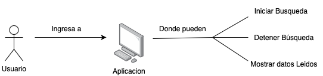

# Avance Proyecto 2
## Integrantes

- Matías Bugueño
- Francisco Cortés

## EP2.1

### Código C++
```C++
#include <Servo.h>
#include <string.h>
#include <SoftwareSerial.h>

class Motor {
private:
   int MOTOR_1A;
   int MOTOR_2A;
   int MOTOR_1B;
   int MOTOR_2B;

public:
   Motor(int pin_1A, int pin_2A, int pin_1B, int pin_2B) {
      MOTOR_1A = pin_1A;
      MOTOR_2A = pin_2A;
      MOTOR_1B = pin_1B;
      MOTOR_2B = pin_2B;

      pinMode(MOTOR_1A, OUTPUT);
      pinMode(MOTOR_2A, OUTPUT);
      pinMode(MOTOR_1B, OUTPUT);
      pinMode(MOTOR_2B, OUTPUT);
   }

   void forward(int speed) {
      analogWrite(MOTOR_1A, speed);
      analogWrite(MOTOR_1B, speed);
      digitalWrite(MOTOR_2A, LOW);
      digitalWrite(MOTOR_2B, LOW);
   }

   void backward(int speed) {
      analogWrite(MOTOR_1A, LOW);
      analogWrite(MOTOR_1B, LOW);
      analogWrite(MOTOR_2A, speed);
      analogWrite(MOTOR_2B, speed);
   }
 
   void turn_right(int speed) {
      analogWrite(MOTOR_1A, LOW);
      analogWrite(MOTOR_1B, speed);
      analogWrite(MOTOR_2A, speed);
      analogWrite(MOTOR_2B, LOW);
   }

   void turn_left(int speed) {
      analogWrite(MOTOR_1A, speed);
      analogWrite(MOTOR_1B, LOW);
      analogWrite(MOTOR_2A, LOW);
      analogWrite(MOTOR_2B, speed);
   }

   void stop() {
      digitalWrite(MOTOR_1A, LOW);
      digitalWrite(MOTOR_2A, LOW);
      digitalWrite(MOTOR_1B, LOW);
      digitalWrite(MOTOR_2B, LOW);
   }
};

SoftwareSerial BT(10, 11); 	
int TRIGGER = 7;
int ECHO = 8;
int degree_head;
int init_degree_head;
Motor motor(3, 5, 6, 9);
Servo servo_1;
String option;
long distance;
  
long ultrasonic_sensor(int trigger, int echo) {
   long time;

   digitalWrite(trigger, HIGH);
   delayMicroseconds(10);
   digitalWrite(trigger, LOW);

   time = pulseIn(echo, HIGH);

   return time / 58.2;
}

void turn_head(int degree, int turn_delay) {
   if(degree_head < degree) {
      for(int i = degree_head; i < degree; i++) {
         servo_1.write(i);
         delay(turn_delay);
      }
   }
   else {
      for(int i = degree_head; i > degree; i--) {
         servo_1.write(i);
         delay(turn_delay);
      }
   }

   degree_head = degree;
}

void actions(long distance_ult) {
   long new_distance;
   String jsonData = "{\"temperature\": " + String(distance_ult, 2) + ", \"humidity\": " + String(new_distance, 2) + "}";

   jsonData = "{\"ultrasonic\": {\"first distance\":" + String(distance_ult, 2);
   if(distance_ult <= 20) {
      motor.stop();
      turn_head(55, 15);
      new_distance = ultrasonic_sensor(TRIGGER, ECHO);
      jsonData = jsonData + ', \"turn head left\": ' + String(new_distance);

      if(new_distance > distance_ult) {
         motor.backward(150);
         delay(50);

         motor.turn_right(150);
         delay(50);

         turn_head(init_degree_head, 15);
         jsonData = jsonData + '}';

         BT.println(jsonData);
         return;
      }
      
      turn_head(155, 15);
      new_distance = ultrasonic_sensor(TRIGGER, ECHO);
      jsonData = jsonData + ', \"turn head right\": ' + String(new_distance);

      if(new_distance > distance_ult) {
         motor.backward(150);
         delay(50);

         motor.turn_left(150);
         delay(50);

         turn_head(init_degree_head, 15);
         jsonData = jsonData + '}';

         BT.println(jsonData);
         return;
      }

      turn_head(init_degree_head, 15);
      motor.turn_right(150);
      delay(70);
   }
   else {
      motor.forward(100);
   }
}

void setup(){
   pinMode(TRIGGER, OUTPUT);
   pinMode(ECHO, INPUT);

   degree_head = 97;
   init_degree_head = degree_head;
   servo_1.attach(4, 500, 2500);
   servo_1.write(degree_head);

   Serial.begin(9600);
   BT.begin(9600);
}

void loop(){
   distance = ultrasonic_sensor(TRIGGER, ECHO);

   if(BT.available()) {
      option = BT.readStringUntil('\n');
      option.trim();
   }

   if(option.equals("run")) actions(distance);
   if(option.equals("stop")) motor.stop();

   delay(500);
}
```

### Código python
```py
import platform
import select
import serial
import json
import time
import sys
import msvcrt

def non_blocking_input_w():
    sys.stdout.flush()
    
    data = ""
    while True:
        if msvcrt.kbhit():  # Verifica si hay entrada disponible en el teclado
            char = msvcrt.getche().decode()  # Lee un carácter
            if char == '\r':  # Si es Enter, termina de leer la entrada
                print()  # Imprime un salto de línea para mantener el formato
                break
            elif char == '\003':  # Si es Ctrl+C, termina el programa
                sys.exit()
            else:
                data += char
        else:
            break  # No hay entrada disponible, termina la función
            
    return data

def non_blocking_input_ml():
    sys.stdout.flush()
    
    ready, _, _ = select.select([sys.stdin], [], [], 0)
    if ready:
        return sys.stdin.readline().rstrip()
    else:
        return None


def read_robot(ser, data, json_file):
    if ser.in_waiting > 0:
        response = ser.readline().decode('utf-8').strip()
    
    if response:
        try:
            data = json.loads(response)
            data_list.append(data)
            
            with open(json_file, 'w') as f:
                json.dump(data_list, f, indent=4)
            
            print("Datos recibidos:", data)
        except json.JSONDecodeError:
            print("Respuesta del Arduino:", response)

def read_user():
    system = platform.system()

    if system == 'Windows':
        promp = non_blocking_input_w()
    if system == 'Linux' or system == 'macOS':
        promp == non_blocking_input_ml()

    return promp

if __name__ == '__main__':
    bluetooth_port = 'COM5'
    baud_rate = 9600

    rescue_robot = serial.Serial(bluetooth_port, baud_rate)
    time.sleep(2)

    json_file = './sensor_data.json'
    data_list = []
    command = ''

    print('Menú Rescue Robot:')
    print('indique la acción que desee realizar:')
    print('1) Empezar la ejecución del robot')
    print('2) Frenar la ejecución del robot')
    print('3) Cerrar programa')


    while True:
        option = read_user()
        if option ==  '1':
            command = 'run'
            rescue_robot.write((command).encode())

        if option == '2':
            command = 'stop'
            rescue_robot.write((command).encode())
        
        if option == '3':
            break

        if command == 'run':
            read_robot(rescue_robot, data_list, json_file)

    rescue_robot.close()
```

## EP2.2

### 1) Comunicación UI
</img>

### 2) Mapa Topográfico
</img>

### 3) Interacción

Inicio:

Usuario: "Comienza la navegación." \
Robot: "Inicializando exploración del laberinto..." 

Exploración del Laberinto:

Robot: "Moviéndome hacia adelante." \
Robot: "Encontré una intersección. Decidiendo la dirección..." \
Robot: "Girando a la derecha." \
Robot: "He encontrado un cuadro rojo. Marcando y continuando la exploración." \
Robot: "Moviéndome hacia adelante." \
Robot: "Llegué a una esquina/intersección con múltiples caminos." \
Robot: "Explorando el primer camino." \
Robot: "Cuadro negro detectado. Evitando y recalculando ruta..." \
Robot: "He encontrado un cuadro verde. Marcando y continuando la exploración." \
Robot: "Girando a la izquierda." \
Robot: "Moviéndome hacia adelante." \
Robot: "Exploración en curso. Decidiendo la dirección..." \
Robot: "Explorando el siguiente camino no explorado." 

Terminación del Proceso:

Usuario: "Detén la navegación." \
Robot: "Deteniendo la exploración. Navegación finalizada."

### 4) Arquitectura de control

</img>

## EP2.3

</img>
</img>